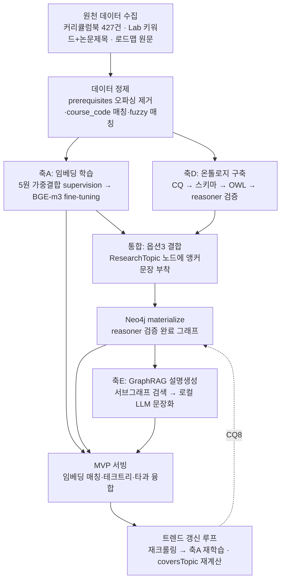
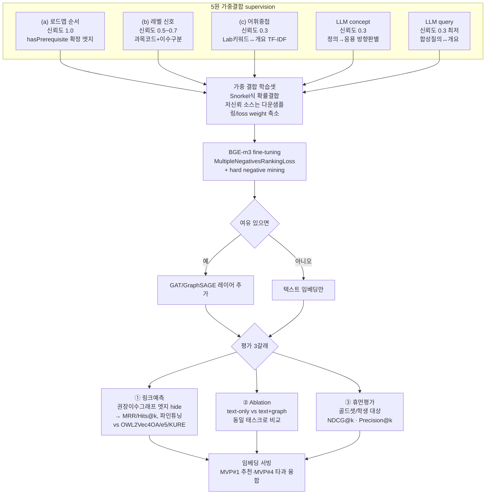
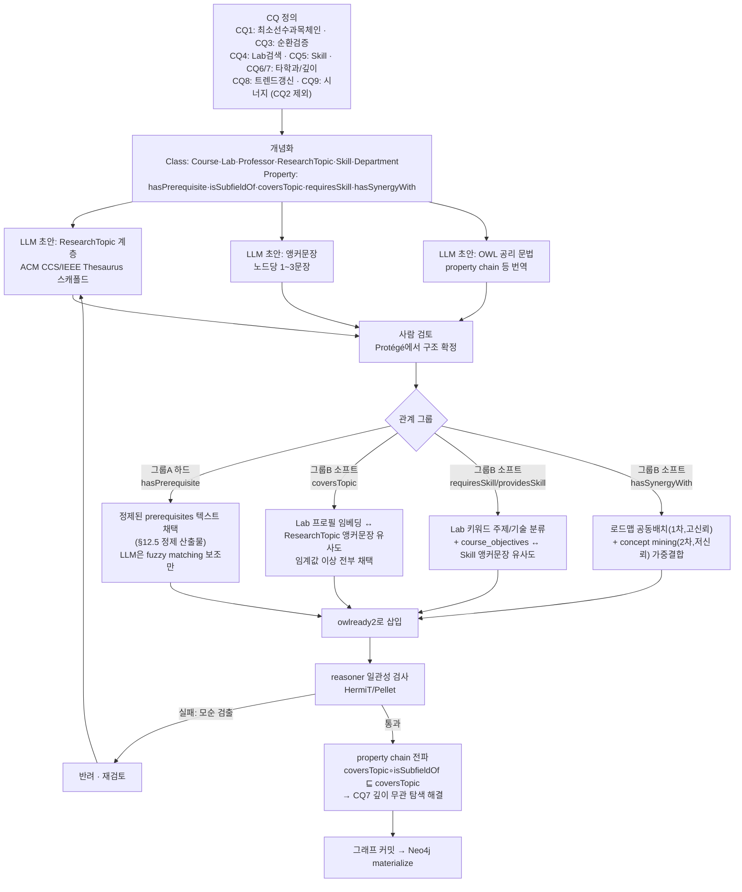
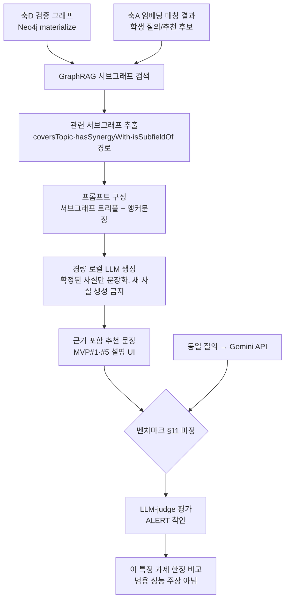
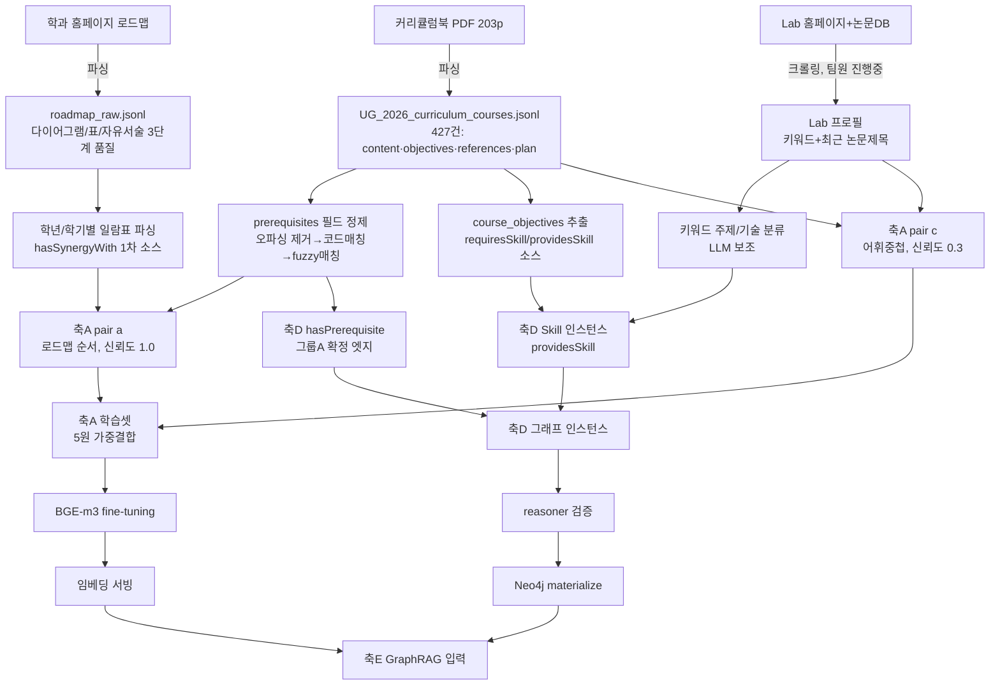

# 3분커리 (3-min Curri) — 프로젝트 설계 문서

> "3분 만에 찾는 나만의 학술 경주로"
> 2026 POSTECH UGRP (기술창업트랙) — 오뚜기 부대 팀

이 문서는 대화를 통해 도출된 설계 내용을 누적 기록한다. 결정된 사항과 미정 사항을 구분해 관리하며, 코드 작성은 별도 지시 전까지 진행하지 않는다.

---

## 1. 미션

파편화된 대학 내 교육 자원(교과목, 연구실, 학사 제도)을 데이터화하여, 학생 개개인의 성향과 관심사에 최적화된 맞춤형 학술/진로 로드맵을 제공하는 AI 기반 진로 설계 및 추천 플랫폼.

## 2. 팀 (오뚜기 부대)

| 이름 | 직책 | 역할 |
|---|---|---|
| 최선우 | CEO | 소프트웨어 개발 총괄 |
| 박서진 | CTO | 기술적 구현 및 AI 모델링 |
| 정우철 | CSO | 현실적 구현 자문, 전략 기획 |

군 복무 중(육군 신호정보/전자전운용병) 동일 부대에서 병행 개발.

## 3. 문제의식 — 포스텍의 역설 (Paradox of Choice)

- 무은재학부 제도(2학년 1학기까지 무전공), 자유로운 타과 수강, 탄력적 진로 설계 → **자유도는 최고 수준**
- 그러나 정보는 강의계획서/에브리타임/학과 홈페이지에 파편화, 가이드 부재 → 학생들은 결국 선배의 경로를 무비판적으로 답습 (선택의 병목, 학생의 획일화)
- 핵심 문제: "자유는 있는데 실행 가이드가 없다"

## 4. 핵심 가치 제안

| 대상 | 제공 가치 |
|---|---|
| 학생 | 탐색 비용 절감, 성향에 맞는 전공/연구 발견 |
| 학교 | 특정 분야 쏠림 없는 고른 자원 배분, 교육 만족도 향상 |

---

## 5. 데이터 소스

### 5.1 확보 가능한 원천 데이터

- **교과목**: 과목명 / 과목코드(ticker) / 선수과목(자유서술, 대부분 부실) / 실라버스 텍스트
- **학과 권장이수체계도**: 학과가 공식 발간하는 학년별·학기별 권장 수강 순서 (선수과목 필드보다 신뢰도 높은 그래프 구조 소스로 채택)
  - **하위 유형 구분(확정, 2026-07-23)**: 이 안에도 성격이 다른 두 표가 섞여 있음을 실제 커리큘럼 PDF 파싱 중 확인했다 — (i) 학과 전체 개설과목을 이수구분별로 나열한 "3. 과목 일람표"(순서 정보 없음), (ii) **"5. 학년/학기별 전공과목 일람표"**: 학년·학기·이수구분별로 배치된 실제 로드맵(순서/동시배치 정보 보유, §7 축D `hasSynergyWith`의 1차 데이터 소스).
- **연구실**: 교수별 대표 키워드 + 최근 논문 제목
- **(Phase 2 보류) 졸업생 진로 데이터**: 존재하는 문서가 아니라 별도 수집(설문 등)이 필요한 유일한 항목

### 5.0 데이터 원칙 (확정, 2026-07-22)

**팀이 실제로 확보 가능한 데이터는 인터넷에 이미 공개된 정형/텍스트 데이터뿐이다.** 설문 등 별도 수집 캠페인을 벌일 수 없고, 재학생 개인의 수강기록 같은 비공개 학사 데이터에도 접근할 수 없다. 이 제약을 약점이 아니라 설계 원칙으로 명시한다:
- MVP 기능은 모두 공개 데이터(실라버스, 권장이수체계도, 연구실 키워드/논문)만으로 구현 가능해야 한다.
- 예외적으로 축 B(상태추적)가 다루는 "학생 수강 이력"은 **제품 출시 후 자사 사용자가 opt-in으로 만들어내는 1st-party 데이터**만을 가리킨다 — 제3자 학생 기록을 스크래핑/설문하는 것이 아니다.
- 부수 효과: 설문/개인정보 수집 절차(IRB 등)가 필요 없어 즉시 배포 가능하고, 추천 근거를 온톨로지+공개 텍스트만으로 100% 설명 가능하다는 점을 "프라이버시-바이-디자인" 서사로 활용한다.

### 5.2 현재 저장소 상태

- `syllabus_raw.jsonl` (353건, EECE/CSED/MATH/IMEN)과 `DATA_ANALYSIS.md`는 **참고용 프로토타입 데이터**로만 취급한다. 실제 개발은 팀이 직접 재크롤링한 데이터(+ 초기에는 더미 데이터)로 진행한다.
- 재크롤링 시 실라버스뿐 아니라 **권장이수체계도, 연구실 키워드/논문 데이터를 1순위로 확보**한다.
- **`UG_2026_curriculum_courses.jsonl`(427건, 신설 2026-07-23 · 2026-08-03 중복/오파싱 정제로 654→427건 축소)**: 학교 공식 커리큘럼북(`UG 2026 curriculum v.2.0`) 전체 203페이지의 "교과목 개요" 절을 끝까지 파싱해 만든 전학과 텍스트 데이터(학수번호·과목명 국영문·학점·개요). `syllabus_raw.jsonl`과 달리 전학과 스케일이며 실제 축A/D 개발의 1차 원문 코퍼스로 사용 가능. 단, **"5. 학년/학기별 전공과목 일람표"(표 형식 로드맵)는 의도적으로 제외**했다 — 이 표는 별도 파싱이 필요한 구조화 데이터이며 아래 §7 축D `hasSynergyWith`의 1차 소스다.

---

## 6. 핵심 기능 (우선순위)

### MVP (6개월 스코프)
1. 관심사 기반 교과목/연구실 추천 (임베딩 매칭)
2. 맞춤형 선수과목 테크트리 생성 — 학년별 분기 (저학년: 기초과목 우선 / 고학년: 수강 이력 기반 방향성 트래킹)
3. 연구실 논문 키워드 트렌드 갱신 파이프라인 (최근 2~3개년 크롤링 → 키워드/임베딩 주기 갱신)
4. 타과 융합 연구실 추천 — 별도 모듈이 아니라 임베딩 공간을 학과로 분리하지 않는 설계로 자연히 확보
5. **(보조 참고정보) 온톨로지 기반 전형적 경로 제시** — 실제 "동료들이 걸은 길"이 아니라, 권장이수체계도+온톨로지 그래프(`hasPrerequisite` 체인, 이수구분 가중치)에서 도출한 "이 관심사라면 논리적으로 자연스러운 전형적 순서"를 보여줌. 개인 수강기록이 전혀 필요 없어 §5.0 데이터 원칙과 정합적이며, 월 1차 확보 데이터만으로 바로 구현 가능. "동료 답습"(§3)을 실제 동료 데이터로 강화할 위험이 없고, 오히려 "이게 왜 자연스러운 경로인지"를 온톨로지 경로로 설명 가능하다는 점에서 §7 축 D의 설명가능성 어필과도 일치.
  - (2026-07-22 이전 초안) "동료 궤적 비교"(재학생 실제 수강경로 익명화)는 폐기 — 필요한 데이터(제3자 학생의 실제 수강기록)를 팀이 합법적으로 확보할 방법이 없음(§5.0)이 뒤늦게 드러나 되돌림.

### Phase 2 보류
- 졸업생 커리어 패스 역추적 (Career Path Mapping) — 신뢰할 데이터 소스가 없어 6개월 내 신뢰성 있는 구축이 어려움. 소규모 파일럿(팀 지인 설문) 여지는 있으나 MVP 정식 기능에서는 제외.

### 6.1 데모(`demo.html`) 시연 고도화 계획 (신설, 2026-08-03)

백엔드 없이 두 관심사 시나리오("시맨틱 통신 연구하고 싶어요" / "피지컬 AI 시대 로봇 안전 연구하고 싶어요")로 추천 파이프라인(임베딩 매칭 → 온톨로지 경로 → 연구실/테크트리 → 설명 생성)을 보여주는 정적 mock UI(`demo.html`)를 만들었다. "너무 밋밋하다"는 피드백에 따라 개선 후보를 논의했다.

**제안된 추가 기능 (미정 — 사용자 우선순위 확정 대기)**:
1. **인터랙티브 지식그래프 지도** (1순위 추천) — 현재 일렬 텍스트 체인인 온톨로지 경로를 노드-엣지 그래프(캔버스/SVG)로 전환. 관심사 노드를 중심으로 연결된 과목/연구실/타 학과 노드가 방사형으로 펼쳐지고, 노드 클릭 시 관계 종류(`hasPrerequisite`/`hasSynergyWith`/`isSubfieldOf`)를 툴팁으로 설명. 타과 융합 시나리오(로봇 안전)에서 두 학과 노드가 인접해 "겹치는" 모습을 시각적으로 보여주는 것이 핵심 가치 — 텍스트 체인보다 온톨로지의 "깊이 있는 다단계 추론" 세일즈 포인트를 훨씬 직관적으로 전달.
2. **단계별 생성 애니메이션** (1순위 추천, 1과 함께) — 버튼 클릭 직후 "임베딩 계산 중… → 그래프 추론 중… → 설명 생성 중…" 순차 연출로 실시간 계산 체감을 부여. 현재는 결과가 순간적으로 바뀌어 정적으로 느껴짐.
3. **테크트리의 학기 타임라인화** (스트레치) — 세로 리스트 대신 "1학년 2학기 / 2학년 1학기…" 학기 축 위에 과목을 배치해 실제 로드맵처럼 보이게 함.
4. **자유 입력창 모의 활성화** — 텍스트박스에 직접 타이핑을 받되, 두 시나리오 문장과 유사하면 해당 결과를, 아니면 "데모 시나리오 두 개만 지원합니다" 안내.
5. **Top-N 후보 비교 랭킹** — 1등 결과만이 아니라 2~3위 후보도 유사도 점수와 함께 리스트업해 "여러 후보 중 골랐다"는 신뢰감 부여.
6. **(기각 방향) 축A 임베딩 2D 산점도** — 관심사 문장과 후보 연구주제가 임베딩 공간에서 얼마나 가까운지 보여주는 산점도는, 실제 임베딩이 없어 좌표를 지어내야 해서 지식그래프 지도만큼 설득력이 안 나옴. 우선순위 낮음.

---

## 7. 기술 아키텍처

핵심 관점: 학생의 연구 방향성은 시간에 따라 진화하는 **상태(state)**, 매 학기 수강 선택은 그 상태에 가하는 **제어입력**, 관측 가능한 건 노이즈 낀 신호(수강 과목, 관심 키워드)뿐이다. 이 관점 위에서 통신/제어/신호처리/딥러닝/강화학습 배경이 하나의 시스템으로 통합된다.

### 축 A — 상태 표현 학습 (Deep Learning) — **현재 최우선 축**

- 기성 SBERT 그대로 사용하지 않고, 도메인 특화 임베딩을 직접 학습한다 (연구 실적화 목적).
- **학습 신호(Supervision)**: `PREREQUISITE` 필드는 결측 90%로 미채택. 대신 (a) 학과 권장이수체계도의 순서 관계, (b) 이수구분+과목코드 기반 약한 레벨 신호, (c) 연구실 키워드-과목 텍스트 어휘 중첩, (d) 팀이 직접 라벨링한 소규모 골드셋(학습에는 미사용, 평가 전용)을 positive pair 소스로 사용.
- **Supervision 보강(확정, 2026-07-22, 근거: Liang et al. AAAI'17 "Recovering Concept Prerequisite Relations from University Course Dependencies", Pan et al. ACL'17 "Prerequisite Relation Learning for Concepts in MOOCs")**:
  - **가중 결합**: (a)~(c)를 단순 합집합이 아니라, 신호별 신뢰도를 반영해 확률적으로 결합한다(Snorkel류 weak-supervision aggregation 검토). 권장이수체계도(a)는 고신뢰, 어휘 중첩(c)은 저신뢰로 차등.
  - **Hard negative mining**: MultipleNegativesRankingLoss의 negative를 무작위가 아니라 "같은 학과·비슷한 레벨이지만 그래프상 연결 안 된 과목"으로 구성해 구분력 있는 표현을 학습.
  - **PU-learning 주의**: 권장이수체계도에 없는 쌍을 곧바로 negative로 취급하지 않는다("관찰 안 됨 ≠ 관계 없음") — §7 평가 프로토콜(링크 예측)에도 동일하게 적용.
  - **과목코드 피처화 확장**: (b) 레벨 신호를 이수구분 플래그뿐 아니라 과목코드 숫자 패턴(학년대 반영 여부 등)까지 세밀화해 반영(Liang et al.에서 검증된 피처).
  - **최신 대체 참고(2026-07-22 추가)**: "A Bayesian approach to inferring prerequisite structures and topic difficulty" (BEA 2025 워크숍) — 선수관계+난이도를 베이지안으로 동시 추론하는 최신 방법론. Liang/Pan(2017)보다 "가중 결합" 아이디어를 더 정교하게 구현할 근거로 우선 검토.
- **모델(확정, 2026-08-03)**: 백본은 **BGE-m3**(다국어, 8192 토큰 긴 컨텍스트, dense/sparse/multi-vector 하이브리드 지원)로 확정. 이 위에 `MultipleNegativesRankingLoss` 등으로 contrastive fine-tuning. 시간이 남으면 텍스트 임베딩 위에 얕은 GAT/GraphSAGE 레이어를 얹어 그래프 구조(선수과목 체인)를 명시적으로 반영 (text-attributed graph representation learning).
  - **최신 참고(2024~2025)**: "Toward General and Robust LLM-enhanced Text-attributed Graph Learning" (2025), "GraphRAG-Induced Dual Knowledge Structure Graphs for Personalized Learning Path Recommendation" (2025, 개인화 학습경로 추천을 그래프+RAG로 다루는 논문이라 옵션3 설계와 직접 비교 대상).
- **베이스라인 비교 대상(확정)**: 옵션3(온톨로지 노드+앵커문장 결합) 구현 시, **OWL2Vec\*** (Chen et al. 2021)의 최신 후속작인 **OWL2Vec4OA** (2024.12, KGSWC — confidence-weighted random walk로 개선)를 §7 평가의 baseline/비교 대상으로 추가한다.
- **평가**: (1) 권장이수그래프 엣지 일부를 hidden하고 링크 예측 정확도 비교(파인튜닝 vs 베이스라인 SBERT), (2) text-only vs text+graph ablation, (3) 팀 라벨링 골드셋/소규모 학생 대상 휴먼 평가(NDCG@k, Precision@k).

### 축 B — 상태 추적 (Signal Processing)

- 학생의 수강 이력을 시계열 신호로 보고, 노이즈 낀 관측(수강 과목, 자기보고 키워드)으로부터 잠재 연구방향 상태를 추정. 칼만 필터 또는 지수가중 이동평균 등 상태추정기 후보.
- 목적: 최근 관심 변화를 과거 이력에 덜 휘둘리며 반영.

### 축 C — 경로 계획 (Control / Reinforcement Learning) — **스트레치 목표**

- "테크트리 생성" 기능의 알고리즘 백엔드. 목표 임베딩까지 상태를 유도하는 문제를 유한구간 최적제어(MPC) 또는 선수과목 DAG 위 MCTS 플래닝으로 정식화.
- 제약조건(선수과목 순서, 학기당 학점 상한, 남은 학기 수)은 하드 제약으로 반영.
- 실제 상호작용 데이터 부재로 초기에는 online RL보다 planning(MCTS/MPC) 우선 고려.
- 알고리즘 최종 선택(MPC vs MCTS vs 기타)은 **미정**.
- **offline RL 검토 후 기각(2026-07-22)**: "Doubly Constrained Offline RL for Learning Path Recommendation", "Privileged Knowledge State Distillation for RL-based Educational Path Recommendation"(KDD 2024) 등 최신 offline RL 계열은 "상호작용 로그가 적을 때 RL 하는 법"을 다루므로 이 축의 제약과 정면으로 관련 있으나, 클로즈베타 이전에는 로그 데이터가 사실상 0이라 학습 자체가 어려울 것으로 판단해 planning(MCTS/MPC) 우선 결정을 유지. 참고: "On Conceptualisation and Overview of Learning Path Recommender Systems in e-Learning" (2024 서베이).

### 축 D — 온톨로지 (Formal Ontology)

- **결정**: 학습 목적을 포함해 formal(OWL 기반)로 간다.
- **방법론**: 표준 온톨로지 엔지니어링 절차 — Competency Questions 정의 → 개념화(클래스/관계/공리) → OWL 2 DL 형식화 → reasoner로 일관성 검증/추론.
- **Competency Questions (확정, 2026-07-22)**:
  | # | 질문 | 관련 관계/기능 |
  |---|---|---|
  | 1 | 학생이 목표 과목 X를 듣기 위해 거쳐야 할 최소 선수과목 체인은 무엇인가? | `hasPrerequisite`(transitive) · MVP #2 테크트리 |
  | 2 | 학기당 학점 상한·남은 학기 수 제약 하에서 목표 과목까지 도달 가능한 이수 순서가 존재하는가? | `hasPrerequisite` · MVP #2, 축 C |
  | 3 | 두 과목이 서로를 선수과목으로 삼는 순환 관계가 존재하는가? | `hasPrerequisite` · 일관성 검증 |
  | 4 | 학생의 관심 ResearchTopic이 주어졌을 때 이 주제를 다루는 Lab/Professor는 어디인가? | `coversTopic` · MVP #1 |
  | 5 | 특정 Lab이 요구하는 Skill들은 무엇이며, 이 Skill을 제공하는 Course는 무엇인가? | `requiresSkill` · MVP #1 |
  | 6 | 서로 다른 Department에 속한 두 Course가 동일하거나 인접한(`isSubfieldOf` depth ≤ k) ResearchTopic을 다루는가? | `isSubfieldOf`, `coversTopic` · MVP #4 타과 융합 |
  | 7 | 깊은 노드(예: SemanticCommunication)와 관련된 모든 Course를, depth 무관하게 찾아낼 수 있는가? | `isSubfieldOf`(transitive) · 깊이 어필 실증 |
  | 8 | Lab의 최근 논문 키워드가 기존 `coversTopic`과 달라졌을 때 이를 어떻게 반영/갱신하는가? | `coversTopic` · MVP #3 트렌드 갱신, 온톨로지 변경관리 |
  | 9 | 과목 X를 필수로 요구하진 않지만, 함께/먼저 들으면 이해에 실질적으로 도움이 되는 과목은 무엇인가? | `hasSynergyWith` · MVP #1·#5 추천 근거, 축E 설명생성 |
- **스키마 초안**:
  - 클래스: `Course`, `Lab`, `Professor`, `ResearchTopic`(계층형), `Skill`, `Department`
  - 관계: `hasPrerequisite`(transitive), `isSubfieldOf`(transitive), `partOfDepartment`, `coversTopic`, `specializesIn`, `requiresSkill`, `hasSynergyWith`(non-transitive, §7.2)
- **깊이 설계 원칙**: transitive 관계 체인이 충분히 깊어야 "LLM beam search는 추론 깊이가 얕고, 우리 온톨로지는 깊이에 무관하게 논리적으로 완전한 다단계 추론이 가능하다"는 어필이 성립한다. 예시(통신 서브도메인, depth 5):
  ```
  ElectricalEngineering → Communications → InformationTheory
    → SemanticCommunication → JointSourceChannelCoding
  ```
- **툴스택**: Protégé(저작) + HermiT/Pellet reasoner(추론·일관성 검증) + Neo4j(추론 완료된 그래프를 런타임 쿼리용으로 materialize) — **확정 보류**, 스키마가 더 무르익은 뒤 재검토 (§11).
- **모델링 우선순위(확정)**: 통신/전자공학 서브도메인을 팀의 전공 지식으로 먼저 깊게 모델링하고, 타 학과는 이후 얕게 확장.
- **근접 선행연구 대비 차별점(확정, 2026-07-23, 근거: Abu-Rasheed et al., "LLM-Assisted Knowledge Graph Completion for Curriculum and Domain Modelling in Personalized Higher Education Recommendations", arXiv 2501.12300, 2025)**: 문제의식(커리큘럼/도메인 모델링 + 개인화 고등교육 추천을 위한 지식그래프)이 우리 축D와 거의 동일한 선행연구. 항상 명시적으로 비교/차별화할 대상으로 취급한다.
  - 이 논문: LLM이 그래프 **완성(completion)**을 직접 담당하며, 평가도 그래프 구조 지표 + 전문가 정성 피드백에 그침(formal reasoner에 의한 논리적 일관성 검증 없음). 스케일도 임베디드시스템/FPGA **2개 모듈**에 국한.
  - 우리: OWL 2 DL + reasoner(HermiT/Pellet)로 논리적 일관성을 검증하고, 링크 예측 기반 정량 평가(§7 축A 평가 프로토콜과 동일 방법론)를 사용하며, EECE 전체 + 타학과 융합까지 스케일을 확장한다. "LLM 추출 그래프의 노이즈/비일관성 vs reasoner 검증된 그래프"가 핵심 차별화 문구.

- **CQ 최종 스코프 확정(2026-08-03)**: CQ2는 축C(경로계획, 스트레치 목표) 알고리즘이 있어야 답할 수 있어 현재 스코프에서 제외. 나머지 8개(CQ1, 3~9)는 모두 데이터 확보 방안이 있어 유효.
- **CQ1/CQ3(`hasPrerequisite`) 근거 정정(2026-08-03)**: 이 관계가 "하드 제약"으로 신중히 다뤄져야 하는 이유는 축C가 아니다(축C는 스트레치 목표로 현재 미착수). 실제 근거는 **MVP #2(선수과목 테크트리 생성)가 이 관계를 학생에게 직접 노출**한다는 점 — 틀린 선수관계를 보여주면 축C 여부와 무관하게 학생이 실제로 잘못된 학사 계획을 세우게 된다. 따라서 이 관계는 LLM이 새로 추론해서 만들어내지 않고, `prerequisites` 필드(정제 후, §7.3)처럼 텍스트에 명시된 사실만 결정적으로 채택한다.
- **CQ5(`requiresSkill`) 데이터 공백 해결(2026-08-03)**: 별도 Skill 어휘를 새로 수집할 필요 없이 이미 확보된/확보 예정인 데이터에서 파생시킨다.
  - `requiresSkill(Lab, Skill)`: Lab의 대표 키워드 중 "주제(도메인)"류와 "기술/방법론"류를 LLM으로 분류해, 기술류만 `Skill` 인스턴스로 승격. Lab 본인이 밝힌 키워드이므로 신뢰도 1.0으로 채택.
  - `providesSkill(Course, Skill)`: `UG_2026_curriculum_courses.jsonl`의 `course_objectives` 필드(427건 전체 보유)와 Skill 앵커문장 간 임베딩 유사도로 생성 — `coversTopic`과 동일한 메커니즘(축A 인프라) 재사용.
  - `Skill`은 `ResearchTopic`과 완전히 배타적인 클래스로 억지로 분리하지 않고, 리프 노드가 겸하거나 서브클래스로 선언 가능.
- **자동화 리스크 그룹핑(확정, 2026-08-03)**: reasoner는 논리적 모순만 잡아내고 사실관계 오류는 못 잡기 때문에, 관계를 두 그룹으로 나눠 자동화 수위를 다르게 적용한다.
  - **그룹 A(하드/사실성)** — `hasPrerequisite`(CQ1, 3): LLM 추론 배제, 텍스트 파싱 결과만 채택(정제 파이프라인은 §7.3). LLM은 fuzzy matching 등 매칭 보조 역할까지만.
  - **그룹 B(소프트/설명용)** — `coversTopic`(CQ4, 8), `requiresSkill`/`providesSkill`(CQ5), `isSubfieldOf` 인스턴스 전파(CQ6, 7), `hasSynergyWith`(CQ9): 오류의 피해가 "추천 품질 저하" 수준에 그쳐, 사람 검수 없이 LLM+임베딩 유사도로 완전 자동화 가능.
- **LLM-assisted, reasoner-gated 온톨로지 구축 워크플로우(확정, 2026-08-03)**: Gemini/Claude로 온톨로지 구축을 돕되, 근접 선행연구(Abu-Rasheed et al.) 대비 차별점("LLM 그래프 완성 vs reasoner 검증된 그래프")과 모순되지 않도록 원칙을 하나 둔다 — **LLM은 제안(propose)만 하고, reasoner의 일관성 검증을 통과한 것만 그래프에 커밋된다.** 즉 "LLM을 안 쓴다"가 아니라 "LLM 출력이 검증 없이 최종 사실이 되는 지점이 없다"는 뜻으로 차별화 문구를 해석한다. 그룹 A(하드)는 LLM의 사실 생성 자체를 배제하고, 그룹 B(소프트)는 LLM 제안 + reasoner 일관성 검사만으로 완전 자동화한다.
  - **주의 — 여기서의 "LLM"은 축A/축E와 다른 별개의 용도다**: 축A(BGE-m3)는 서비스 운영 중 실시간으로 도는 임베딩 인코더, 축E(경량 로컬 LLM)는 서비스 운영 중 학생에게 추천 근거를 자연어로 설명하는 생성 모델. 반면 이 워크플로우의 Gemini/Claude는 **개발 단계에서 팀이 온톨로지를 저작할 때 쓰는 도구**일 뿐이며, 산출물(OWL 파일)만 남고 서비스 서빙 시점에는 관여하지 않는다.

### 축 E — 생성/설명 계층 & LLM 벤치마크

- "자체 LLM engine이 Gemini API보다 낫다"는 주장은 **범용 성능이 아니라 이 특정 과제(커리큘럼/연구실 추천 + 근거 생성)에서의 우위**로 해석. 온톨로지+검색으로 확정된 사실만 가지고 문장을 다듬는 경량 로컬 모델이 현실적 형태.
- **(2026-07-23) 축E를 축A·축D와 함께 연구실적화 플래그십 축으로 확정.** 벤치마크 세부 과제 정의(비교 지표 등)는 여전히 **사용자가 추후 직접 설계 — 미정**이나, 착안점으로 ALERT(NAACL 2025, LLM-judge 기반 추천 설명생성 평가 벤치마크)를 §7.1 문헌 스터디 트래커에 등록.
- **메모(2026-07-22, 축E 재개 시 검토): GraphRAG를 설명생성 기법으로 편입.** 축D가 만든 reasoner 검증 완료 그래프(Neo4j materialize)를 축E의 검색 대상으로 삼아, "Neo4j에서 관련 서브그래프 검색 → LLM에 넣어 자연어 설명 생성" 구조를 GraphRAG 방식으로 구현. 그래프 자체가 LLM 추출이 아니라 reasoner가 만든 것이라 일반 GraphRAG의 "그래프 노이즈" 문제가 없음 — 온톨로지(추론)와 GraphRAG(설명생성)는 경쟁 관계가 아니라 파이프라인의 다른 단계를 맡음. GraphRAG로 온톨로지를 대체하면 "LLM보다 깊이 있게 완전하다"는 축D 서사가 스스로 무효화되므로, 대체가 아닌 결합으로만 고려.

### 7.1 문헌 스터디 트래커 (신설, 2026-07-23)

연구실적화 플래그십 축으로 확정된 **축A·축D·축E** 각각에 대해, 구현 결정을 뒷받침하는 논문을 지속적으로 추적한다. 상태는 `미착수 / 읽음 / 적용중 / 구현완료`로 관리하며, 로드맵(§8) 진행에 맞춰 갱신한다. 새 논문을 발견하면 이 표에 먼저 등록한 뒤, 실제 설계 반영 여부는 §9에 결정사항으로 기록한다.

**축 A — 상태 표현 학습**

| 논문 | 출처/연도 | 상태 | 활용 목적 |
|---|---|---|---|
| Liang et al., "Recovering Concept Prerequisite Relations from University Course Dependencies" | AAAI 2017 | 적용중 | supervision 가중결합 근거 |
| Pan et al., "Prerequisite Relation Learning for Concepts in MOOCs" | ACL 2017 | 적용중 | supervision 가중결합 근거 |
| "A Bayesian approach to inferring prerequisite structures and topic difficulty" | BEA 워크숍 2025 | 읽음 | 가중결합 방법론의 최신 대체안 검토 |
| "GraphRAG-Induced Dual Knowledge Structure Graphs for Personalized Learning Path Recommendation" | arXiv 2025 (2506.22303) | 읽음 | 옵션3(온톨로지+앵커문장) 설계 직접 비교 대상 — 축E와 공유 |
| "Toward General and Robust LLM-enhanced Text-attributed Graph Learning" | 2025 | 미착수 | 텍스트+그래프 결합 표현학습 참고 |
| KaLM-Embedding-V2 / cropping-vs-dropout augmentation | arXiv 2025 | 미착수 | 임베딩 학습 테크닉 보조 참고 (필수 아님) |

**축 D — 온톨로지**

| 논문 | 출처/연도 | 상태 | 활용 목적 |
|---|---|---|---|
| Abu-Rasheed et al., "LLM-Assisted Knowledge Graph Completion for Curriculum and Domain Modelling in Personalized Higher Education Recommendations" | arXiv 2501.12300, 2025 | 읽음(초록) | **근접 선행연구 — 차별화 근거** (본문 §7 축D 참고) |
| OWL2Vec\* 후속작 OWL2Vec4OA | KGSWC 2024/2025 | 확정 | 평가 baseline |
| "LLM-Powered Construction of Course Knowledge-Competency Graphs" | ICETAI 2025 | 미착수 | 온톨로지 반자동 구축(LLM 보조) 방법 검토 |
| "Heterogeneous LLM Methods for Ontology Learning" | arXiv 2508.19428 | 미착수 | LLM 보조 온톨로지 학습 일반 방법론 |
| "LLM-empowered knowledge graph construction" (survey) | arXiv 2510.20345 | 미착수 | 관련연구(Related Work) 섹션 작성용 서베이 |

**축 E — 생성/설명 계층**

| 논문 | 출처/연도 | 상태 | 활용 목적 |
|---|---|---|---|
| "GraphRAG-Induced Dual Knowledge Structure Graphs for Personalized Learning Path Recommendation" | arXiv 2025 (2506.22303) | 읽음 | 핵심 방법론 참고 (§7 축E 메모와 연결) |
| "Path-Based Explanations for Knowledge Graph-Driven Course Recommendation" | Springer 2025 | 미착수 | 근접 선행연구 가능성 — 원문 확인 후 §7 축E에 차별화 여부 재검토 |
| LlamaRec-LKG-RAG | arXiv 2506.07449, 2025 | 미착수 | 단일패스 학습가능 KG-RAG 랭킹 구조 참고 |
| ALERT benchmark | NAACL 2025 | 미착수 | Gemini 벤치마크 설계 시 LLM-judge 평가 방법론 착안점 |
| "Can Explanations Improve Recommendations? Evidence from Prediction-Informed Explanations" | arXiv 2502.16759, 2025 | 미착수 | 설명생성이 추천 품질을 높인다는 동기부여 근거 |
| JuStRank | ACL 2025 | 미착수 | LLM judge 벤치마킹 방법론 참고 |

### 7.2 `hasSynergyWith` — 명시적 선수과목 밖의 "시너지" 관계 (신설, 2026-07-23)

**문제**: 실제 데이터로 확인된 사례 — `EECE233`(신호및시스템)의 교과목 개요 텍스트에는 선수과목 언급이 전혀 없다. 반면 `EECE301/306/308/309/320` 등 8개 과목은 "선수과목 : 신호및시스템"이라고 명시해, EECE233을 가리키는 edge는 많지만 EECE233 *자신이 무엇에 기반하는지*는 텍스트만으로 전혀 드러나지 않는다. 그런데 전자전기공학과의 **"5. 학년/학기별 전공과목 일람표"**(§5.1)를 보면 `MATH203`(응용선형대수)이 EECE233 바로 앞 학기, 같은 전공필수 슬롯에 공식 배치되어 있다 — 자유서술 선수과목 필드가 잡지 못하는 관계가, 로드맵 표의 **학기 위치**에는 존재한다.

- **관계 정의**: `hasSynergyWith(A, B)` — A를 먼저/함께 이수하면 B의 학습에 실질적으로 도움되지만, B 수강의 필수조건은 아님. **`hasPrerequisite`와 의도적으로 분리**(방향성 결정, 2026-07-23):
  - `hasPrerequisite`: 텍스트로 명시된 필수 관계, transitive, **축C 경로계획의 하드 제약**이자 CQ#1/#2(최소 선수과목 체인, 이수 가능 여부) 계산에 사용.
  - `hasSynergyWith`: 로드맵 공동배치 등에서 추론된 권장 관계, non-transitive, 축C에서는 **소프트 가점**(하드 제약 아님)으로만 사용, 주 용도는 추천 랭킹·근거 설명(축E). 두 관계를 하나로 합치면 CQ#1의 "최소 선수과목 체인"에 선택 과목까지 섞여 들어가 축C 하드 제약 계산이 오염된다는 것이 분리의 핵심 근거.
- **1차 추출 방법**: §5.1에서 신설 구분한 "학년/학기별 전공과목 일람표" 표를 학과별로 파싱해 (학과, 학년, 학기, 이수구분, 학수번호) 튜플화. 같은 학과 로드맵 내에서 더 이른 (학년,학기) 슬롯의 과목 → 더 늦은 슬롯의 과목으로 후보 edge 생성(학기 거리가 멀수록 confidence 감쇠). `hasPrerequisite`로 이미 확정된 쌍은 제외해 중복 표현을 막는다.
- **2차/보강 방법(로드맵에 없는 순수 타학과 시너지용, 예: 로드맵에 없는 MATH333↔CSED226 같은 쌍)**: §7 축A에서 이미 결정한 개념 단위 접근을 재사용 — Liang et al. AAAI'17 / Pan et al. ACL'17 스타일 concept-level dependency mining. 각 과목 개요에서 후보 개념구(concept phrase)를 추출해 "어느 과목이 그 개념을 정의/도입하는가"를 앵커로 삼고, 다른 과목이 그 개념을 정의 없이 응용만 하면 정의 과목 → 응용 과목 방향으로 `hasSynergyWith` 후보 생성. 로드맵 기반 신호(고신뢰)와 개념 마이닝 기반 신호(저신뢰)를 축A와 동일한 "가중 결합" 원칙(§7 축A)으로 합친다.
- **축A와의 관계**: 학년/학기별 로드맵 데이터는 축A 지도학습 신호 (a)(권장이수체계도의 순서 관계)와 **동일한 원천을 공유**한다 — 단 축A는 이를 임베딩 학습용 연속 신뢰도 신호로, 축D는 이를 이산적 OWL object property(`hasSynergyWith`)로 사용한다는 점이 다르다. 같은 표를 두 축이 각자 방식으로 소비하므로, 로드맵 표 파싱 파이프라인은 축A/축D 공용 인프라로 1회만 구축하면 된다.

### 7.3 축A 학습 데이터 구성 & 로드맵 자료 수집 결산 (신설, 2026-08-03)

- **축A 백본 확정**: 사전학습 인코더는 **BGE-m3**로 확정(다국어, 8192 토큰 긴 컨텍스트, dense/sparse/multi-vector 하이브리드). multilingual-e5-large·KURE-v1은 §7 평가 프로토콜(링크 예측)의 비교 baseline으로만 사용.
- **학습 pair 구성 원칙**: 아래 5개 소스를 신뢰도 가중치와 함께 하나의 학습셋으로 결합(하나의 모델을 학습시키는 것이며, 소스별로 별도 모델을 두지 않음). 전부 **자체 수집 데이터 기반**이며, 오픈 데이터셋(KLUE-STS/KorSTS/KorNLI 등)은 pair 소스가 아니라 워밍업/회귀테스트·방법론 검증용 별도 트랙으로 분리한다.

  | 소스 | anchor | positive | 신뢰도 | 생성 방법 |
  |---|---|---|---|---|
  | (a) 로드맵 순서 | 선수과목 개요 | 후속과목 개요 | 1.0 | `hasPrerequisite` 확정 엣지(텍스트 명시) |
  | (b) 레벨 신호 | 저학년 필수과목 개요 | 고학년 관련과목 개요 | 0.5~0.7 | 과목코드 앞자리(학년대)+이수구분 플래그 |
  | (c) 어휘중첩 | 연구실 키워드/논문 초록 | 과목개요 | 0.3 | TF-IDF/어휘 overlap 상위 쌍 |
  | LLM concept | "정의 과목" 개요 | "응용만 하는 과목" 개요 | 0.3(c와 동급) | §7.2 2차방법과 동일 메커니즘: LLM이 concept phrase 추출 → 정의/응용 방향 판별 |
  | LLM query | 합성 질의 | 과목개요 | 0.3, 검수 전까지 최저티어 | Claude/Gemini로 "이 과목을 찾을 법한 자연어 질의" structured output 생성 — 실제 서비스의 질의-문서 분포에 맞춘 augmentation |

  낮은 신뢰도 소스는 다운샘플링 또는 loss weight 축소로 반영(Snorkel식 확률결합의 실무적 근사).

- **(b) 레벨 신호 페어 생성 규칙 확정(2026-08-04)**: `UG_2026_curriculum_courses.jsonl`에 이수구분(전공필수/선택) 필드가 없다는 점을 확인 — 표에 적힌 "이수구분 플래그"는 현재 데이터로는 못 만든다. 대신 **학년 규칙만 사용**(과목코드 학과 prefix 뒤 첫 숫자를 학년으로 취급: 1/2학년 vs 3/4학년), 필수 여부 조건은 제거. "관련" 판정은 **같은 학과(code prefix) 내부로 한정** — 학과 무관 전체 조합(N×M)은 무관한 쌍이 대량 섞여 기각. 이 변경으로 신뢰도는 원래 0.5~0.7에서 **0.4**로 하향 조정(필수과목이라는 강한 신호가 빠졌으므로). 이수구분이 필요해지면 §11 열린 질문에 추가된 "전공과목 일람표 재파싱"으로 보강 가능.

- **`prerequisites` 필드 실사 결과(2026-08-03)**: `UG_2026_curriculum_courses.jsonl`(427건, 2026-08-03 정제 후 기준) 점검 결과 `"없음"` 외에 `"-"` 같은 사실상 결측값도 존재(예: AMSE405/406). 또한 **오파싱 사례 발견** — `AMSE407`은 `prerequisites` 필드에 강의계획서 전체(주차별 커리큘럼)가 통째로 들어간 컬럼 밀림 버그. (a) 소스로 채택 전 "오파싱 제거 → 자유서술 내 course_code 매칭 → 매칭 성공분만 채택"의 정제 단계가 필요함을 확인. 자유서술 값 중에는 `AMSE201 -> General Physics, General Chemistry`처럼 코드가 아닌 과목명만 있는 경우도 많아 fuzzy matching 또는 폐기 판단이 필요.
- **학과별 로드맵 데이터 품질 3단계**(로드맵 원문 수집 결과로 확인, `roadmap_raw.jsonl`에 저장):
  1. **다이어그램/구조화표 보유**(MECH, IMEN, 반도체 트랙[소속 학과명 미확인 — 확인 필요], CITE): (a)(b) 고신뢰 소스를 사람이 이미 검증한 형태로 확보 가능.
  2. **로드맵은 있으나 자유서술 텍스트뿐**(PHYS): 학년/트랙 구조는 있지만 파싱 필요.
  3. **그 외 대다수 학과**: 위 `prerequisites` 필드 정제 + (c) 어휘중첩 + LLM concept mining(§7.2 2차방법)에만 의존.
  - **결정(2026-08-03)**: 전학과 다이어그램 커버를 목표로 삼지 않고, 다이어그램 수집은 여기서 마무리. 나머지 학과는 텍스트 기반 파이프라인((c)+LLM concept mining)으로 진행.
- **CITE(IT융합공학과) 자료의 특별한 가치**: 트랙별(의공학/인간-로봇공학/지능형시스템공학/디자인공학) 추천과목 리스트에 EECE/MECH/AMSE/CSED/LIFE 등 타학과 과목코드가 이미 명시적으로 묶여 있어, §7.2 `hasSynergyWith` 2차방법(로드맵에 없는 순수 타학과 시너지, 예시로 든 MATH333↔CSED226류)의 **실증 사례이자 고신뢰 소스**로 concept mining 없이 바로 활용 가능.

### 7.4 타학과 시너지 신호의 구조적 한계와 보강 후보 (신설, 2026-08-03)

- **문제 진단**: 학과 권장이수체계도는 학과 내부 과목끼리의 순서만 기록하는 문서라서, 타학과 과목쌍은 (a) 신호 관점에서 사실상 전량 unlabeled다. 이는 §7 축A의 "PU-learning 주의"(미관찰 ≠ 관계 없음) 수준을 넘어, **특정 범주(타학과 쌍) 전체가 구조적으로 라벨 신호 자체가 없는 상황**이다. 이대로 학습하면 모델이 "타학과 과목은 다 무관하다"는 편향을 학습할 위험이 있다.
- **대응 후보 (검토중, 아직 채택 안 됨)**:
  1. 개념 단위 마이닝(§7.2 2차방법) — 이미 메인 대응책으로 결정됨
  2. 연구실 키워드-과목 어휘중첩 신호 (c)를 학과 경계 없이 전역 적용
  3. 소규모 사람 라벨링 시드 + 임베딩 유사도 기반 확산
  4. Hard negative mining 시 타학과 쌍을 negative 후보군에서 제외/저가중 — "타학과=무관" 편향이 negative sampling을 통해 재유입되는 것을 차단
  5. 평가를 학과내부 쌍 / 타학과 쌍으로 분리 리포트 — 근본 해결은 아니지만 최소 비용으로 문제를 가시화
- **신규 후보 신호 (e) 과목명 표면 유사도**: 구현 비용은 매우 낮음(문자열/임베딩 유사도로 즉시 계산 가능). 단, "동치 관계"(사실상 같은 과목의 이중개설)와 "시너지 관계"를 혼동할 위험이 있고, 신호 자체는 방향성(정의→응용)을 주지 못하므로 (b) 과목코드 레벨 신호와 결합해 방향을 정해야 함.
- **신규 후보 신호 (f) 교재/강의계획 목차 유사도**: 당초 "별도 크롤링 필요"로 판단했으나, **`UG_2026_curriculum_courses.jsonl`에 이미 `course_references`(지정 교재)·`course_plan`(주차별 강의계획) 필드로 존재함을 확인**(2026-08-03)해 추가 크롤링 없이 바로 활용 가능. 427건 기준 필드 커버리지 실측(2026-08-03 정제 후 재실측 필요 — 아래 표는 정제 전 654건 기준 수치, TODO):

  | 필드 | 비어있지 않은 건수 | 비율 |
  |---|---|---|
  | `course_references` (교재) | 392 | 60% |
  | `course_plan` (강의계획) | 484 | 74% |
  | 둘 다 있음 | 386 | 59% |
  | 둘 중 하나라도 있음 | 490 | 75% |
  | 둘 다 없음 | 164 | 25% |

  `course_plan`은 "Week 1 (Chapter 1~2)"처럼 비정형 자유서술이라 유사도 계산 전 챕터 단위 정규화/파싱이 필요함. 실제 채택 여부와 가중치는 **미정** — 위 대응 후보들과 함께 다음 세션에서 계속 논의.

---

## 8. 대략적 로드맵 (6개월 가정)

| 월 | 작업 |
|---|---|
| 1 | 크롤링(실라버스+권장이수체계도+연구실 키워드/논문), 그래프/온톨로지 초안 구축 |
| 2 | 베이스라인 임베딩(기성 인코더) + 평가 프로토콜 확정 |
| 3 | Contrastive fine-tuning, 베이스라인 대비 비교 |
| 4 | (스트레치) 그래프 정제 레이어 + 경로계획 알고리즘 프로토타입 |
| 5 | 시스템 통합 + 클로즈베타(무은재학부·고학년 50~100명) |
| 6 | 정리, 대회/논문 제출 준비 |

---

## 9. 결정된 사항 vs 미정 사항

### 결정됨
- **데이터 원칙(§5.0)**: 팀이 확보 가능한 데이터는 공개 정형/텍스트 데이터뿐 — 설문·비공개 학생기록 수집 불가. MVP 기능은 전부 이 제약 안에서 구현 가능해야 한다.
- MVP #5는 "동료 궤적 비교"(재학생 실제 수강경로 익명화)가 아니라 **"온톨로지 기반 전형적 경로 제시"**로 확정 — 실제 동료 데이터 없이 권장이수체계도+그래프 구조만으로 구현 (§5.0 데이터 원칙 위반 문제로 폐기 후 대체, 2026-07-22)
- 축A supervision을 가중결합/hard negative mining/PU-learning 주의/과목코드 피처화로 보강 (근거: Liang et al. AAAI'17, Pan et al. ACL'17; 최신 대체 참고 BEA 2025) — §7 축A 참고
- 옵션3(온톨로지+앵커문장 결합) 구현 시 **OWL2Vec4OA**(2024, OWL2Vec\* 후속작)를 평가 baseline으로 추가
- 축C: offline RL(2024~2025 최신 계열)을 검토했으나 클로즈베타 전 로그 데이터 부재로 기각, planning(MCTS/MPC) 우선 결정 유지 (§7 축C)
- 팀의 시간/여력(군복무 병행) 문제는 현재 논의에서 재검토하지 않음 — 사용자가 명시적으로 보류 지시 (2026-07-22)
- 현재 `syllabus_raw.jsonl`/`DATA_ANALYSIS.md`는 참고용, 실제 데이터는 재크롤링 + 초기 더미 데이터로 진행
- SBERT 그대로 사용하지 않고 도메인 특화 임베딩을 직접 학습 (연구 실적화)
- 연구 기여 우선순위: 축 A(상태표현학습) 최우선, 축 C(경로계획)는 스트레치
- **(2026-08-03) 축A 백본을 BGE-m3로 확정** — multilingual-e5-large/KURE-v1은 비교 baseline으로만 사용 (§7 축A 참고)
- MVP 기능: 임베딩 매칭 추천, 테크트리 생성, 논문 트렌드 갱신 파이프라인, 타과 융합 검색(통합 임베딩 공간으로 자연 확보)
- 커리어 패스 매핑은 Phase 2로 보류
- 온톨로지는 formal(OWL)로 진행, 학습 목적 포함
- 온톨로지 깊이(transitive 체인)를 의도적으로 깊게 설계 — "LLM beam search 얕은 깊이" 대비 논리적 완전성 어필이 목적
- Gemini 대비 벤치마크 설계는 사용자가 추후 별도로 진행 (현재는 다루지 않음)
- 코드 작성은 사용자의 명시적 개발 지시 전까지 하지 않는다
- 더미 데이터 정책: 사전에 전체 스키마를 설계하지 않는다. 설계/개발 중 특정 데이터가 필요할 때(팀이 요구하거나 Claude가 요청) 그 데이터는 "존재한다"고 가정하고 즉석에서 필요한 형태로 정의한다.
- MCP 서버(Learning Summarizer, Daily Work Summary)와 본 시스템의 관계는 현재 논의에서 스킵 — 별도 요청 전까지 다루지 않는다.
- 태그 vs 온톨로지: **옵션 3(결합) 풀스케일 채택**. `ResearchTopic` 계층 전체 노드에 처음부터 앵커문장을 부착하며, 별도의 flat 태그 체계는 두지 않는다. (§10 결론)
- 통신/전자공학(EECE) 서브도메인을 팀 전공 지식으로 먼저 깊게 모델링하고, 타 학과는 이후 얕게 확장한다.
- **연구실적화 플래그십 축: 축A+축D+축E 병행 확정 (2026-07-23)** — 군복무 병행 리소스 제약상 셋을 동시에 깊게 파는 대신, 축A는 이미 최우선 축이라 자연 포함, 축D/E는 이번 결정으로 활성화(§7 축E "(보류)" 해제).
- **§7.1 문헌 스터디 트래커 신설(2026-07-23)** — 축A/D/E별 논문을 상태(미착수/읽음/적용중/구현완료)·활용목적과 함께 지속 추적. 새 논문 발견 시 이 표에 먼저 등록 후 실제 설계 반영 여부를 이 섹션에 기록하는 절차로 운영.
- **축D 근접 선행연구 차별점 명시(2026-07-23)** — Abu-Rasheed et al., arXiv 2501.12300(2025)가 커리큘럼/도메인 모델링+개인화 고등교육 추천 KG라는 거의 동일한 문제의식을 다룸. 우리는 (1) formal reasoner(HermiT/Pellet) 기반 논리적 일관성 검증, (2) 링크예측 정량평가, (3) EECE 전체+타학과 융합 스케일에서 차별화 (§7 축D 참고).
- **`hasSynergyWith` 관계 신설, `hasPrerequisite`와 분리(확정, 2026-07-23)** — "신호및시스템(EECE233)은 자신의 선수과목을 텍스트로 밝히지 않지만 응용선형대수(MATH203)와 학과 로드맵상 인접 배치된다" 같은, 자유서술 선수과목 필드로는 못 잡는 관계를 별도 non-transitive object property로 모델링하기로 결정. `hasPrerequisite`(transitive·축C 하드 제약)와 섞으면 CQ#1 최소 선수과목 체인 계산이 오염된다는 것이 분리 근거. 1차 데이터 소스는 §5.1에서 새로 구분한 "학년/학기별 전공과목 일람표"(로드맵 표, 공동배치 신호) — §5.2 `UG_2026_curriculum_courses.jsonl` 구축 시 의도적으로 제외해둔 부분이라 별도 파싱 필요. 상세 정의·추출 방법은 §7.2.
- **`UG_2026_curriculum_courses.jsonl`(427건, 2026-08-03 중복/오파싱 정제 후) 구축 완료(2026-07-23)** — 공식 커리큘럼 PDF 203페이지 전체를 "교과목 개요" 절 기준으로 파싱해 전학과 스케일 텍스트 코퍼스 확보. `syllabus_raw.jsonl`(참고용, §5.2)을 대체할 실제 축A/D 1차 원문 데이터로 사용 가능해짐.
- **축D CQ 최종 스코프 확정(2026-08-03)** — CQ2(축C 필요)만 제외, 나머지 8개(CQ1,3~9) 전부 유효. CQ5(`requiresSkill`)의 데이터 공백은 Lab 키워드 분류 + `course_objectives` 임베딩 유사도로 신규 수집 없이 해결. `hasPrerequisite`가 신중히 다뤄져야 하는 근거는 축C가 아니라 MVP#2 직접 노출로 정정. 자동화 리스크를 그룹A(하드, LLM 사실생성 배제)/그룹B(소프트, 완전자동화 가능)로 구분(§7 축D).
- **LLM-assisted, reasoner-gated 온톨로지 구축 원칙 확정(2026-08-03)** — Gemini/Claude는 온톨로지 저작을 돕는 개발 단계 도구(축A/축E와 별개)로 활용하되, 모든 산출물은 reasoner 일관성 검증을 통과해야 커밋된다는 원칙으로 근접 선행연구 대비 차별화를 유지.
- **전체 개발 워크플로우 문서화(2026-08-03, §12)** — 전체 플로우, 축A/축D 개별 플로우, 데이터셋 생성 파이프라인을 mermaid 다이어그램으로 정리.
- **연구실 데이터 없이 시작 가능한 축A 소스 확정(2026-08-04)** — 5원 소스 중 (a)로드맵순서·(b)레벨신호·LLM concept·LLM query는 연구실 데이터(§12.5 S5/S6, 팀원 진행중) 없이 지금 생성 가능, (c)어휘중첩만 정의상 Lab 프로필이 있어야 블로킹됨을 확인. (a)는 `UG_2026_prerequisites_freetext.jsonl`/`_needs_review.jsonl`(자유서술 선수과목 fuzzy 매칭, 작업 중·미완료) 병합이 끝나야 확정되므로 후순위, **(b) 레벨 신호부터 먼저 생성**하기로 결정(§7.3 규칙 확정과 함께).

### 미정 / 확인 필요
- 온톨로지 툴스택(Protégé + HermiT/Pellet + Neo4j) 확정 여부 — **아직 이르다고 판단, 보류**. 온톨로지 스키마가 더 무르익은 뒤 재논의.
- 경로계획 알고리즘 최종 선택(MPC vs MCTS vs 기타)
- 대시보드/UX 설계
- Gemini 벤치마크 과제 정의 (보류 상태 유지)
- 타학과 시너지 신호 보강 방법 최종 채택 여부(§7.4) — 개념 마이닝 외 negative sampling 조정/신규 신호 (e)(f) 반영 여부는 아직 결정 안 됨

---

## 10. 태그 vs 온톨로지 전략 비교 (논의 중)

원래 기획서의 "Custom Tag Score Vector"(태그별 앵커문장 → 문서와의 유사도 스코어링)와, 이후 도입한 formal 온톨로지의 `ResearchTopic` 계층이 어떤 관계여야 하는지 논의 중.

### 옵션 1 — 태그(앵커문장)만 유지, 온톨로지는 별도
- **방식**: 태그는 flat한 리스트. 태그별 앵커문장과 문서 간 SBERT 유사도로 점수 벡터 산출. 온톨로지는 선수과목/추론용으로 독립 운영.
- **장점**: 구현 단순. dense 임베딩과 자연 결합. 태그 추가가 쉬움(앵커문장만 추가).
- **단점**: 태그 간 관계(계층/포함/전이성)가 없어 "깊이 있는 추론" 스토리(§7 축 D)와 단절됨. 태그가 늘어날수록 앵커문장 일관성 관리가 어려워짐. 두 체계(태그/온톨로지)가 따로 놀아 정합성 문제 발생 가능.

### 옵션 2 — 온톨로지만, 태그(앵커문장) 폐기
- **방식**: `ResearchTopic` 계층 자체가 태그 역할을 겸함. 추천 근거는 온톨로지 경로("A→B→C")로만 제공.
- **장점**: 체계가 하나로 단순화됨. 다단계 추론 깊이 어필과 완전히 일치.
- **단점**: 심볼릭 관계만으로는 자유서술 텍스트(실라버스, 논문 제목)의 미묘한 의미 차이를 못 잡음 — 연속적인 유사도 점수를 못 냄, 이진적/카테고리적 매칭에 그침. 온톨로지에 없는 개념은 아예 표현이 안 됨(커버리지 갭에 취약).

### 옵션 3 — 결합: 온톨로지 노드에 앵커문장을 부착 (권장)
- **방식**: 태그를 별도 체계로 두지 않고, `ResearchTopic` 각 노드(계층적으로 조직된 온톨로지 개념)에 대표 앵커문장(들)을 속성으로 부착. 문서-노드 간 dense 유사도(soft score) + 노드 간 심볼릭 관계(전이적 추론)를 동시에 확보.
- **장점**: 옵션 1의 설명가능한 연속 스코어링과 옵션 2의 깊이 있는 다단계 추론을 모두 가짐. "이 과목은 SemanticCommunication 노드와 유사도 0.81이고, 이 노드는 Communications→InformationTheory 경로 위에 있다"처럼 두 근거를 함께 제시 가능.
- **단점**: 설계/유지 복잡도가 가장 높음 — 온톨로지 노드를 추가/수정할 때마다 앵커문장도 함께 관리해야 함(동기화 부담). 노드별 앵커문장 품질이 나쁘면 dense score 신뢰도가 떨어짐.

**결론(2026-07-22)**: 옵션 3 풀스케일 채택. `ResearchTopic` 계층 전체에 앵커문장을 부착하고, 노드 추가/수정 시 앵커문장 동기화를 온톨로지 편집 워크플로우의 필수 단계로 취급한다.

## 11. 열린 질문 (다음 논의)

- 경로계획 알고리즘(축 C): MPC vs MCTS 중 어느 쪽을 프로토타입 우선순위로 둘 것인가?
- 대시보드/UX: 추천 근거(온톨로지 경로 + 유사도 점수)를 사용자에게 어떻게 시각화할 것인가?
- 온톨로지 툴스택: 스키마가 무르익으면 Protégé/HermiT/Pellet/Neo4j 조합을 재검토할 시점을 언제로 볼 것인가?
- (b) 레벨 신호에 이수구분(전공필수/선택) 플래그를 다시 넣을 것인가 — 필요해지면 PDF "전공과목 일람표"(§7.1 findings) 재파싱으로 보강 가능하나 별도 추출 작업이 필요해 지금은 보류(§7.3)

---

## 12. 전체 개발 워크플로우 (신설, 2026-08-03)

지금까지 축별로 흩어져 논의된 결정들을 하나의 실행 순서로 묶는다. 축A/축D는 이미 인프라(코퍼스, 가중결합 원칙, reasoner 검증)를 공유하므로, 완전히 독립된 파이프라인이 아니라 **데이터 정제 단계를 공유하는 하나의 흐름**으로 봐야 한다.

### 12.1 전체 플로우



**아래 설명**: 데이터 정제(B)는 축A와 축D가 함께 쓰는 공용 인프라다 — 특히 `prerequisites` 필드 정제(오파싱 제거→코드/fuzzy 매칭)는 축A의 supervision 소스 (a)이자 축D의 `hasPrerequisite`(그룹 A, §7 축D) 채택 소스로 동시에 쓰인다. 축A(임베딩)와 축D(온톨로지)는 별도로 만들어지지만 §10에서 결정한 "옵션3"(E) 단계에서 결합되고, 이 결합된 그래프가 Neo4j에 materialize된 뒤(F) 축E(G)와 MVP 서빙(H)의 공통 기반이 된다. 서비스가 나간 뒤에도 끝나는 게 아니라, Lab 논문/키워드가 갱신될 때마다(I) `coversTopic` 같은 파생 관계를 재계산해 그래프에 다시 반영하는 순환 구조다(CQ8).

### 12.2 축A 플로우 — 상태 표현 학습



**아래 설명**: 5개 supervision 소스(Pa~Pe)는 신뢰도가 다르므로 단순 합집합이 아니라 Snorkel식 확률결합으로 가중 결합(W)한다 — 이게 축A의 핵심이자 가장 손이 많이 가는 단계다. 여기서 나온 pair로 BGE-m3를 hard negative mining과 함께 파인튜닝(A3)하고, 리소스가 남으면 그래프 레이어를 얹는 갈림길(A4)이 있다. 최종 산출물은 3갈래로 검증한다 — ①**링크예측**은 권장이수그래프에서 엣지 일부를 숨기고 파인튜닝 모델이 베이스라인(OWL2Vec4OA, multilingual-e5, KURE-v1) 대비 얼마나 잘 복원하는지 MRR/Hits@k로 비교, ②**Ablation**은 text-only와 text+graph 버전을 같은 태스크로 비교해 그래프 레이어의 실제 기여도를 검증, ③**휴먼평가**는 팀 골드셋/소규모 학생 대상으로 추천 리스트 관련도를 NDCG@k(순위 가중 품질)·Precision@k(상위 k개 중 관련 비율)로 채점한다. 세 결과가 합쳐져야 비로소 실제 서빙에 쓰이는 임베딩(A8)이 확정된다.

### 12.3 축D 플로우 — 온톨로지



**아래 설명**: CQ(D1)에서 스키마를 역산(D2)하는 표준 절차 이후, LLM은 세 갈래(계층 초안·앵커문장·OWL 문법, D3a~c)로 초안을 내고 사람이 Protégé에서 확정(D4)한다. 그다음 관계를 그룹A/B로 나눠 인스턴스를 채운다(D5) — 그룹A(`hasPrerequisite`, D6)는 §12.5에서 정제된 텍스트만 결정적으로 채택하고, 그룹B는 관계마다 채우는 방식이 다르다: `coversTopic`(D7a)은 Lab 프로필과 앵커문장의 임베딩 유사도, `requiresSkill`/`providesSkill`(D7b)은 키워드 분류+`course_objectives` 유사도, `hasSynergyWith`(D7c)는 로드맵 공동배치와 concept mining의 가중결합. 무엇을 삽입하든(D8) 마지막엔 반드시 reasoner 일관성 검사(D9)를 통과해야 하고, 통과분은 property chain(D11)으로 상위 관계까지 자동 전파되어 CQ7을 해결한 뒤 Neo4j에 커밋된다(D12). 실패하면 반려되어 LLM 초안(D3a) 단계로 돌아간다 — "LLM은 제안만, reasoner가 검증한 것만 커밋"이라는 §7 축D 원칙의 실제 구현이다.

### 12.4 축E 플로우 — 생성/설명 계층



**아래 설명**: 축E의 입력은 두 갈래다 — 축D가 reasoner로 검증해둔 그래프(IN1)와 축A 임베딩 매칭이 뽑아낸 추천 후보(IN2). 이 둘을 합쳐 GraphRAG가 관련 서브그래프를 검색(SUB)하고, 그 트리플+앵커문장을 프롬프트로 구성(PROMPT)해 경량 로컬 LLM이 문장화(GEN)한다. 축D 그래프가 이미 reasoner 검증을 거쳤기 때문에 일반 GraphRAG가 겪는 "그래프 자체의 노이즈" 문제가 없고, 로컬 LLM은 확정된 사실을 다듬을 뿐 새 사실을 만들지 않는다(§7 축E 정의와 일치). 벤치마크(BENCH~SCORE)는 동일 질의를 Gemini API에도 던져 LLM-judge(ALERT 착안)로 비교하되, "범용 성능"이 아니라 "이 특정 과제에서의 우위"로 해석 범위를 한정한다 — 세부 지표는 §11에서 여전히 미정.

### 12.5 데이터셋 생성 파이프라인 (실무 세부, 축A·D·E 공용)



**아래 설명**: 세 원천(커리큘럼북·로드맵·Lab)이 각각 파싱되어(S2/S4/S6) 정제 단계(T1~T4)를 거치는 것까지는 §12.4 이전과 같지만, 여기서는 그 산출물이 실제로 어디로 흘러가는지 끝까지 추적한다 — 축A 학습셋(V1→V2→V5)과 축D 그래프 인스턴스(V3→V4→V6)가 각자 완성된 뒤, 최종적으로 **둘 다 축E(W1)의 입력**으로 합류한다. 즉 축A·축D는 병렬로 만들어지는 두 산출물이지만, 서비스 시점에는 축E가 이 둘을 함께 소비하는 구조로 수렴한다. 같은 정제 산출물(T1: `prerequisites` 정제)이 축A pair(U1)와 축D `hasPrerequisite`(U4) 양쪽에 동시에 쓰이는 지점이, 정제 파이프라인을 한 번만 구축해도 되는 이유다.

**아래 설명**: 세 원천(커리큘럼북, 학과 로드맵, Lab 정보)이 각각 다른 파싱을 거쳐(S2/S4/S6) 정제 단계(T1~T4)로 모이고, 여기서 나온 산출물이 축A의 학습 pair(U1, U2)와 축D의 Skill 인스턴스(U3)로 각각 흘러들어간다. 같은 원천 데이터가 축A/축D 양쪽에서 재사용되는 지점(`prerequisites` 정제 → 로드맵 순서 pair + `hasPrerequisite`, `course_objectives` → 어휘중첩 pair + Skill 소스)이 이 파이프라인을 한 번만 구축하면 되는 이유다.
